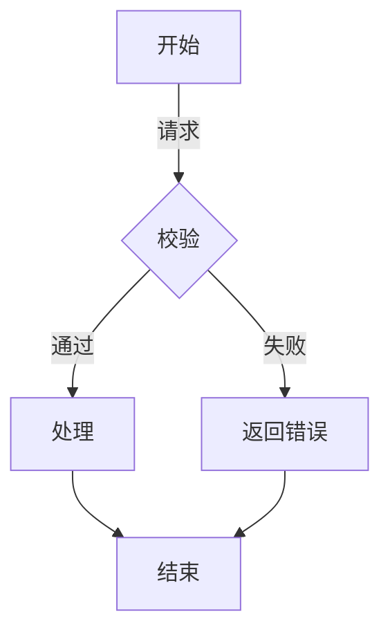
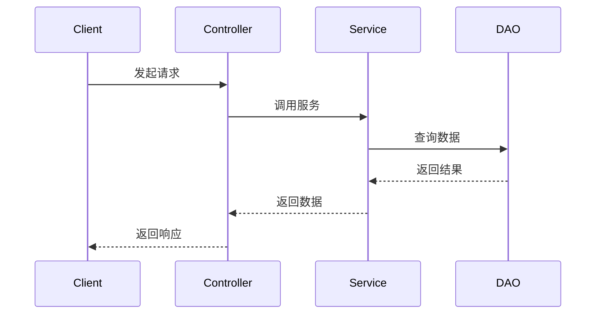
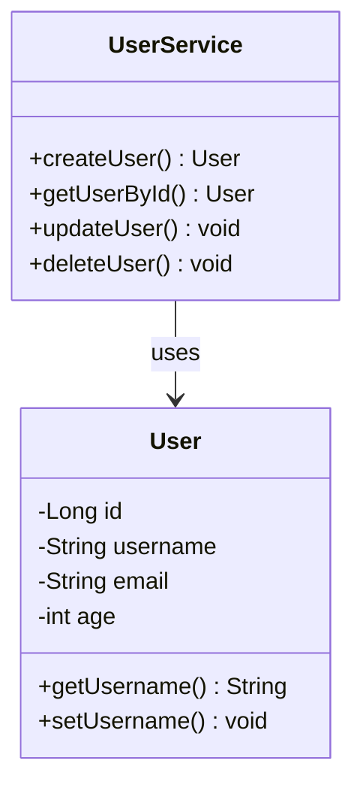
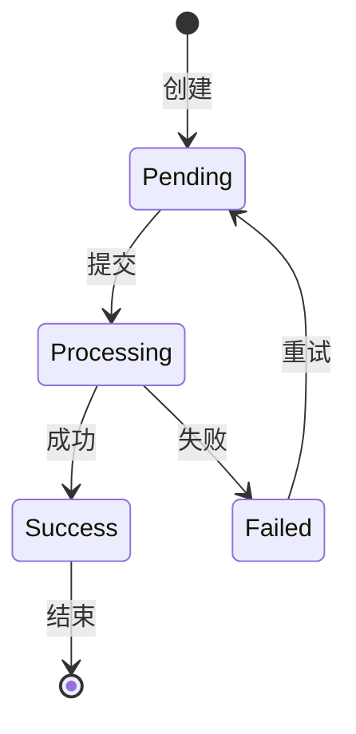
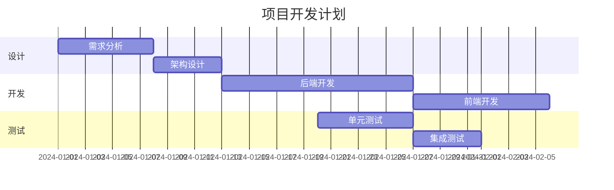
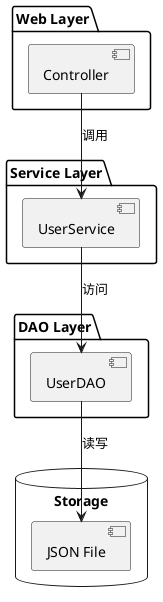
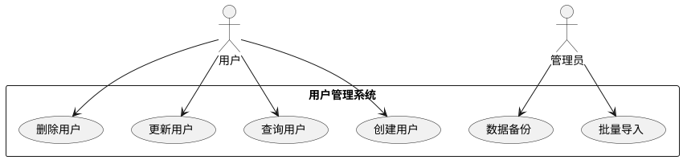
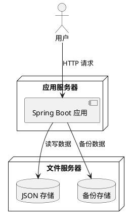
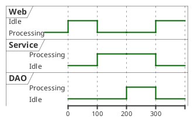

# 用户管理系统

基于 Spring Boot 和 JSON 文件存储的用户管理系统，演示了多种设计模式的实际应用。

## 功能特性

- 📁 基于 JSON 文件持久化存储
- 🔧 Spring Boot 框架集成
- 🧩 多种设计模式组合应用
- ⚡ 责任链模式处理用户创建流程
- 🎯 策略模式支持不同用户类别
- 🏗️ 建造者模式优雅创建对象
- 🔄 自动备份机制
- 📝 完整的 CRUD 操作

## 技术栈

- Spring Boot 3.x
- Lombok - 简化实体类
- 纯 Java 实现，无第三方 JSON 依赖

## 项目结构

```
src/main/java/com/example/demo/
├── config/
│   └── JacksonConfig.java              # Jackson 配置
├── dao/
│   └── JsonFileUserDao.java           # JSON 文件数据访问层
├── entity/
│   └── User.java                      # 用户实体类（含建造者模式）
├── handler/                           # 处理器层（责任链+策略模式）
│   ├── UserCreateHandler.java          # 处理器接口
│   ├── UserCreateContext.java          # 上下文类
│   ├── UserCreateHandlerChain.java     # 处理器链编排者
│   ├── ParameterValidationHandler.java   # 参数校验处理器
│   ├── BusinessValidationHandler.java    # 业务校验处理器
│   ├── UserPersistenceHandler.java      # 数据持久化处理器
│   ├── BusinessValidationStrategy.java  # 业务校验策略接口
│   ├── PrimaryUserValidationStrategy.java   # 主用户校验策略
│   ├── SecondaryUserValidationStrategy.java  # 从用户校验策略
│   └── UserType.java                  # 用户类别枚举
├── controller/
│   └── UserControllerSpring.java       # 用户控制器
├── service/
│   └── SimpleFileUserService.java      # 用户服务层
└── UserCenterApplication.java          # 启动类
```

## 设计模式应用

### 1. 责任链模式

用于用户创建流程的处理，将复杂的业务逻辑拆分为独立的处理器。

**执行顺序：**
```
参数校验 → 业务逻辑校验 → 数据持久化
```

**核心类：**
- `UserCreateHandler` - 处理器接口
- `ParameterValidationHandler` - 参数校验处理器
- `BusinessValidationHandler` - 业务校验处理器
- `UserPersistenceHandler` - 数据持久化处理器
- `UserCreateHandlerChain` - 处理器链编排者

**使用方式：**
```java
@Autowired
private UserCreateHandlerChain handlerChain;

// 创建用户
User user = handlerChain.execute("张三", "zhangsan@example.com", 25, UserType.PRIMARY);
```

**优势：**
- 各处理器独立，职责单一
- 易于扩展新增处理器
- 灵活调整执行顺序

### 2. 策略模式

在业务校验处理器中使用，根据用户类别选择不同的校验策略。

**核心类：**
- `BusinessValidationStrategy` - 策略接口
- `PrimaryUserValidationStrategy` - 主用户校验策略
- `SecondaryUserValidationStrategy` - 从用户校验策略

**策略差异：**

| 校验项 | 主用户 | 从用户 |
|--------|--------|--------|
| 邮箱唯一性 | ✅ | ✅ |
| 数量限制 | 1000 | 500 |
| 邮箱域名 | 任意 | @company.com |
| 年龄限制 | 无限制 | 必须≥18岁 |

**使用方式：**
```java
// BusinessValidationHandler 中使用 Map 管理策略
private Map<UserType, BusinessValidationStrategy> strategyMap;

// 根据用户类别选择策略
BusinessValidationStrategy strategy = strategyMap.get(context.getUserType());
strategy.validate(context);
```

### 3. 建造者模式

用于优雅地创建 User 对象，避免参数过多的问题。

**核心类：**
- `User.Builder` - 静态内部类

**使用方式：**
```java
// 传统方式
User user1 = new User("张三", "zhangsan@example.com", 25);

// 建造者模式
User user2 = User.builder()
    .username("李四")
    .email("lisi@example.com")
    .age(30)
    .build();
```

**优势：**
- 链式调用，代码清晰
- 参数赋值语义明确
- build() 方法中进行参数校验

### 设计模式总结

| 设计模式 | 应用场景 | 核心类 |
|---------|---------|--------|
| 责任链模式 | 用户创建流程处理 | UserCreateHandler, UserCreateHandlerChain |
| 策略模式 | 不同用户类别的业务校验 | BusinessValidationStrategy 及实现类 |
| 建造者模式 | User 对象的创建 | User.Builder |

### 设计模式扩展建议

- [ ] 添加观察者模式，监听用户创建事件
- [ ] 添加工厂模式，根据用户类别创建不同 User 对象
- [ ] 添加单例模式，管理配置和连接池


## 数据存储

数据以 JSON 格式存储在 `data/` 目录下：

```json
[
  {
    "id": 1,
    "username": "张三",
    "email": "zhangsan@example.com",
    "age": 25,
    "createTime": "2026-03-03 00:00:00",
    "updateTime": "2026-03-03 00:00:00"
  }
]
```

## 备份机制

系统自动维护备份文件，位于 `data/backup/` 目录：
- 每次写入数据前自动备份
- 最多保留 10 个备份文件
- 备份文件名格式：`users_backup_<timestamp>.json`

```

## 运行项目

```bash
# 编译
mvn clean compile

# 运行
mvn spring-boot:run
```

## 图表绘制规范

本项目所有技术方案图表采用语法化方式绘制，支持版本管理和迭代修改。

### Mermaid 图表规范

Mermaid 用于绘制流程图、序列图、状态图等。

#### 流程图 (Flowchart)

**语法示例：**


**规范要求：**
- 使用 `TD` (Top-Down) 或 `LR` (Left-Right) 指定方向
- 节点使用描述性名称
- 条件分支使用 `|条件描述|` 格式
- 菱形节点表示判断/决策
- 矩形节点表示处理步骤
- 圆角矩形表示开始/结束

#### 序列图 (Sequence Diagram)

**语法示例：**


**规范要求：**
- 使用 `->>` 表示同步消息
- 使用 `-->>` 表示返回消息
- 参与者使用清晰的业务名称
- 消息描述简明扼要

#### 类图 (Class Diagram)

**语法示例：**


**规范要求：**
- `-` 表示私有成员，`+` 表示公有成员
- 方法包含返回类型
- 使用箭头表示关系：`-->` 依赖, `-->|` 关联, `*--` 组合, `o--` 聚合, `<|--` 继承, `<..` 实现

#### 状态图 (State Diagram)

**语法示例：**


**规范要求：**
- 使用 `[*]` 表示开始/结束状态
- 状态转换使用 `-->` 和条件描述
- 状态名称使用大驼峰或全大写

#### 时序图 (Gantt Chart)

**语法示例：**


### PlantUML 图表规范

PlantUML 用于绘制更复杂的架构图和时序图。

#### 架构图 (Component Diagram)

**语法示例：**


#### 用例图 (Use Case Diagram)

**语法示例：**


#### 部署图 (Deployment Diagram)

**语法示例：**


#### 时机图 (Timing Diagram)

**语法示例：**


### 图表使用规范

1. **图表选择**
   - 流程图：业务流程、处理逻辑
   - 序列图：API 调用、交互流程
   - 类图：类结构、关系设计
   - 状态图：状态转换、生命周期
   - 架构图：系统架构、模块关系
   - 用例图：功能场景、用户角色
   - 时序图：任务规划、里程碑

2. **命名规范**
   - 文件命名：`[模块]-[类型].md`，如 `user-flowchart.md`
   - 图表标题：简洁明了，描述核心内容

3. **版本管理**
   - 所有图表代码纳入 Git 版本控制
   - 提交信息包含图表变更说明
   - 重大变更更新对应文档

4. **渲染支持**
   - 使用支持 Mermaid 的 Markdown 编辑器（VS Code、Typora 等）
   - PlantUML 可通过插件或在线工具渲染

5. **维护原则**
   - 代码变更同步更新相关图表
   - 保持图表与代码的一致性
   - 定期审查和更新过时图表


## 注意事项

1. JSON 文件读写使用线程安全机制
2. 数据修改时自动触发备份
3. 参数校验分为格式校验和业务规则校验
4. 主用户和从用户有不同的业务规则
5. 建造者模式会自动校验必填字段

